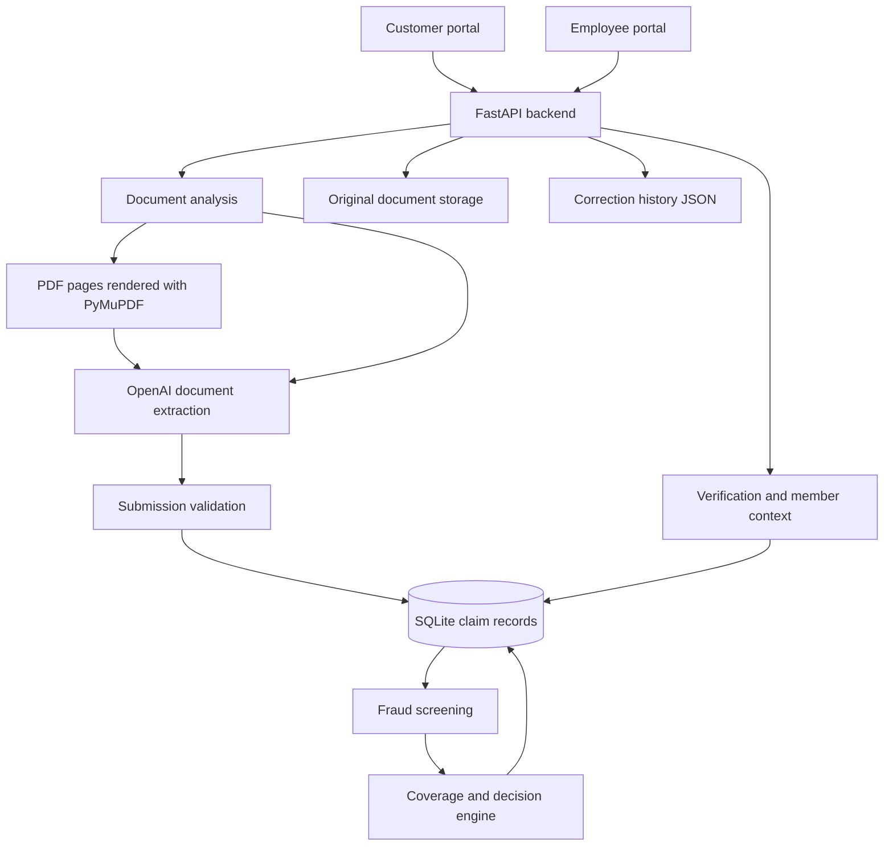

# Care Flow — Claim Readiness Platform

Care Flow is a healthcare reimbursement claim prototype that helps members prepare claims and gives claims specialists a shared workspace to review them. It combines document analysis, validation, coverage rules, fraud signals, and member corrections in a React application backed by FastAPI and SQLite.

The customer and employee portals use the same claim records. The interface presents extracted information, supporting documents, readiness checks, and decision explanations to support the review process.

## Contents

- [Features](#features)
- [Architecture](#architecture)
- [Technology stack](#technology-stack)
- [Repository structure](#repository-structure)
- [Local setup](#local-setup)
- [Using the application](#using-the-application)
- [Claim processing](#claim-processing)
- [API reference](#api-reference)
- [Data and configuration](#data-and-configuration)
- [Development and verification](#development-and-verification)
- [Troubleshooting](#troubleshooting)
- [Current limitations](#current-limitations)
- [Contributing and license](#contributing-and-license)

## Features

### Customer portal

- Sign in with a customer account from the database.
- View claims, statuses, and notifications in a customer dashboard.
- Upload invoices, medical reports, prescriptions, or combined documents through one upload area.
- Review extracted claim details and receive explanations when submission validation fails.
- Submit field corrections with reasons while preserving the original extracted record.
- Track review outcomes and requests for additional information.

### Employee portal

- Access a demonstration employee dashboard using a configured employee ID.
- Browse and filter claims, view summary cards, and open individual claim reviews.
- Inspect original uploaded documents, AI summaries, verification checklists, and claim timelines.
- Review policy assessments, fraud indicators, member information, and medical history.
- Accept or reject member corrections, or request supporting information.
- Approve or reject claims, keep them pending, or request additional documents.
- Manage blacklist entries through the review workflow and backend API.

### Analysis and decision services

- **Document extraction:** classify documents and extract claim data using the configured OpenAI model.
- **Submission validation:** check billing and clinical evidence, required data, identity consistency, dates, duplicate invoices, and cross-document discrepancies.
- **Coverage evaluation:** classify benefits and apply configured limits, copayments, exclusions, and member tiers.
- **Fraud screening:** use document fingerprints, similarity checks, member history, and blacklist signals.
- **Decision automation:** evaluate eligible routine claims and recurring treatments against explicit rules.
- **Member context:** provide policy, family, consent, and medical-history endpoints.

## Architecture



The browser calls the backend at `http://127.0.0.1:8001`. The backend handles persistence, invokes document analysis, and returns customer-facing or employee-facing representations of the stored claims.

## Technology stack

| Layer | Implementation |
| --- | --- |
| Frontend | React 19, JavaScript/JSX, CSS |
| Frontend tooling | Vite 8, ESLint 10, npm lockfile |
| Backend | Python, FastAPI, Uvicorn, Pydantic |
| Document analysis | OpenAI Python SDK; `gpt-4o` is configured in the source |
| PDF handling | PyMuPDF |
| Database | SQLite through Python's `sqlite3` |
| Correction persistence | JSON sidecar with atomic file replacement |
| Configuration | `python-dotenv` |
| TLS trust | `truststore`, using operating-system certificates |

## Repository structure

```text
claim-readiness-platform/
├── backend/
│   ├── main.py                 # API entry point and request handlers
│   ├── ai_service.py           # Document rendering, prompts, and extraction
│   ├── validation.py           # Checks before saving a claim
│   ├── database.py             # SQLite access, normalization, document storage
│   ├── policy_rules.py         # Benefits, tiers, limits, and coverage evaluation
│   ├── cchi_policy.py          # Policy-reference checks used by verification
│   ├── decision_engine.py      # Unified decisions and automation rules
│   ├── fraud_detection.py      # Fingerprints, risk signals, and blacklist
│   ├── member_profile.py       # Policies, family, consent, and history
│   ├── verification.py         # Employee verification checklist
│   ├── user_corrections.py     # Correction submissions and reviews
│   ├── schema_upgrade.py      # Additive database schema upgrades
│   ├── reset_claims.py         # Test-data inspection and reset utility
│   └── requirements.txt
├── frontend/
│   ├── src/
│   │   ├── App.jsx             # Customer and employee navigation
│   │   ├── pages/              # Customer pages and employee review pages
│   │   ├── components/         # Shared and employee UI components
│   │   ├── services/           # Correction API client
│   │   └── data/               # Demo employees and example dashboard data
│   ├── package.json
│   └── vite.config.js
├── database/
│   ├── claimDB.db              # Included SQLite database
│   ├── claim.sql               # Base schema/reference SQL
│   ├── claim_extension.sql     # Additional reference SQL
│   └── cliam.json              # Existing JSON reference file
├── my-project/                 # Separate minimal React starter
├── ai/                         # Placeholder directory
├── docs/                       # Placeholder directory
└── README.md
```

Use **`frontend/`** to run Care Flow. `my-project/` currently renders a separate “Hello React!” starter and is not the application portal.

## Local setup

### Prerequisites

- Python **3.10 or newer** for the backend and its TLS dependency.
- Node.js **22.13 or newer within the Node 22 release line**, or Node.js **24+**, with npm. These versions satisfy the checked-in Vite and ESLint engine requirements.
- Git.
- An OpenAI API key with access to the model configured in `backend/ai_service.py` for document analysis.
- The included `database/claimDB.db` file.

### 1. Clone the repository

```bash
git clone https://github.com/danaabdullah9/claim-readiness-platform.git
cd claim-readiness-platform
```

### 2. Install backend dependencies

```bash
cd backend
python3 -m venv .venv
source .venv/bin/activate
python -m pip install -r requirements.txt
```

On Windows PowerShell, create and activate the environment with:

```powershell
cd backend
py -m venv .venv
.\.venv\Scripts\Activate.ps1
python -m pip install -r requirements.txt
```

Create `backend/.env` with your own key:

```dotenv
OPENAI_API_KEY=your_openai_api_key_here
```

The repository ignores `.env` files. The key is read by the backend; it does not belong in frontend code.

### 3. Prepare the database and start the API

From `backend/`, with the virtual environment active:

```bash
python schema_upgrade.py
python -m uvicorn main:app --reload --host 127.0.0.1 --port 8001
```

The upgrade script adds supporting tables and missing columns, and initializes policy and consent records for existing users. It can be run repeatedly. It expects the base tables in the included database; it is not a complete empty-database bootstrap. Much of `database/claim.sql` is commented reference SQL, so running that file alone is not a replacement for the bundled database.

Start **`main:app`**, which registers the application routes. The separate FastAPI object in `ai_service.py` is not the main API entry point.

| Local service | URL |
| --- | --- |
| API base | `http://127.0.0.1:8001` |
| Interactive API documentation | `http://127.0.0.1:8001/docs` |
| Alternative API documentation | `http://127.0.0.1:8001/redoc` |
| OpenAPI schema | `http://127.0.0.1:8001/openapi.json` |

### 4. Start the frontend

Open another terminal at the repository root:

```bash
cd frontend
npm ci
npm run dev
```

Open the local URL printed by Vite, normally `http://localhost:5173`.

## Using the application

### Customer workflow

1. Open the welcome page and choose the customer entry point.
2. Sign in with an existing account in the SQLite `Users` table. There is no registration endpoint; obtain a demo account from the project maintainer.
3. Start a claim from the customer dashboard.
4. Attach supporting documents and submit them for analysis.
5. Resolve any validation errors, then review the extracted summary.
6. Submit corrections where necessary and return to the dashboard to track the claim.

**Persistence detail:** a claim that passes validation is saved during `POST /api/analyze-claim`, before the summary confirmation screen. The final confirmation does not call a separate claim-creation endpoint.

### Employee workflow

1. Select the employee portal on the welcome page, or open `http://localhost:5173/#/employee`.
2. Use a configured demo ID: `EMP1001`, `EMP1002`, or `EMP1003`.
3. Open a claim to review its documents, extracted information, checklist, and decision context.
4. Resolve member corrections before approving the claim.
5. Update the claim status or request additional supporting documents.

The current employee UI checks these IDs against `frontend/src/data/employeeClaims.js` and remembers the selection in browser local storage. The backend also has an employee email/password login endpoint, but the current employee login screen does not use it.

## Claim processing

### Uploads and extraction

- The frontend accepts PDF, PNG, JPG, JPEG, and WebP files.
- A request can contain **1–8 files**; each PDF can contain at most **10 pages**.
- Empty files and identical file contents within one request are rejected.
- PDF pages are rendered to images before analysis.
- Documents are classified as `Invoice`, `Medical Report`, `Prescription`, or `Other` for storage.
- A combined document can provide both billing and clinical evidence; completeness matters more than the number of attachments.

### Validation and normalization

`backend/validation.py` applies required-field, evidence, document-consistency, identity, date, and duplicate checks before the claim is saved. The configured submission window is **90 days**. Identity comparison includes name normalization and approximate matching.

`backend/database.py` normalizes dates, amounts, and currency. Claim totals are stored in SAR; conversions use fixed approximate rates defined in the source, with original currency information retained in metadata.

### Coverage, risk, and decisions

The decision engine combines benefit classification, member policy, annual usage, configured coverage rules, fraud signals, and recurring-treatment context. Configured tiers are `Essential`, `Standard`, `Gold`, and `VIP`.

Automation rules cover selected consultations, pharmacy claims, preventive dental care, routine lab work, and chronic refills. Their individual thresholds and additional eligibility conditions are defined in `backend/decision_engine.py`; the configured absolute automation ceiling is SAR 1,500.

The policy modules identify a 2022 CCHI policy edition as their reference. These are descriptions of the repository's implementation, not a certification of current policy compliance or insurer product terms.

### Corrections and statuses

Corrections preserve the original extracted claim and are stored separately in `database/user_corrections.json`. Employees can mark a correction `accepted`, `rejected`, or `additional_information_required`. Rejections require a comment; requests for more information require a comment and document type. Unresolved corrections block approval through the employee status endpoint.

The database stores `Pending`, `Approved`, or `Rejected` claim statuses. `Action Required` is represented through customer notifications rather than an additional value in the base claim-status column.

## API reference

The running backend's `/docs` page provides request schemas and an interactive explorer.

| Method | Path | Purpose |
| --- | --- | --- |
| POST | `/login` | Customer email/password login |
| POST | `/api/analyze-claim` | Analyze uploaded documents, validate, save, and evaluate a claim |
| GET | `/api/claims/{claim_id}` | Read a stored claim |
| GET | `/api/customers/{user_id}/dashboard` | Customer claims and notifications |
| GET | `/api/claims/{claim_id}/corrections` | Read correction history |
| PUT | `/api/claims/{claim_id}/corrections` | Submit corrections |
| PATCH | `/api/claims/{claim_id}/corrections/{field}/review` | Review a submitted correction |
| POST | `/api/employee/login` | Backend employee email/password login |
| GET | `/api/employee/claims` | List claims for employee review |
| GET | `/api/employee/claims/{claim_id}` | Employee claim detail |
| GET | `/api/employee/claims/{claim_id}/documents/{document_id}` | View an original document |
| PATCH | `/api/employee/claims/{claim_id}/status` | Update status or request documents |
| GET | `/api/employee/claims/{claim_id}/intelligence` | Decision, checklist, policy, family, and history context |
| GET | `/api/employee/blacklist` | List blacklist entries |
| POST | `/api/employee/blacklist` | Add a blacklist entry |
| DELETE | `/api/employee/blacklist/{entry_id}` | Remove a blacklist entry |
| PATCH | `/api/employee/members/{user_id}/tier` | Change a member's configured tier |
| GET | `/api/members/{user_id}/family` | Read family, policy, and consent details |
| PATCH | `/api/members/{user_id}/consent` | Update sharing preferences |
| GET | `/api/members/{user_id}/history` | Read medical history and policy |

Example analysis request, using a valid local user ID and your own sample files:

```bash
curl -X POST http://127.0.0.1:8001/api/analyze-claim \
  -F "user_id=1" \
  -F "files=@/path/to/invoice.pdf" \
  -F "files=@/path/to/medical-report.pdf"
```

Successful analysis returns `status`, `claim_id`, `data`, and `decision`. Submission validation failures return HTTP `422`, usually with `detail.message` and a `detail.rejections` list containing rejection codes, titles, and explanations. Upload constraint failures use `400`; invalid login uses `401`; unresolved corrections can produce `409` when approving.

## Data and configuration

### Persistence

| Location | Contents |
| --- | --- |
| `database/claimDB.db` | Users, employees, claims, providers, diagnoses, document metadata, notifications, policies, family links, consent, medical history, fraud data, recurring treatments, and decisions |
| `backend/uploads/` | Original uploaded files written by `database.py` |
| `database/user_corrections.json` | Member corrections and employee review history |

Base entities include `Users`, `Employees`, `Providers`, `Doctors`, `Diagnoses`, `Claims`, and `Documents`. Supporting tables include `ClaimNotifications`, `ClaimDocumentFiles`, `MemberPolicy`, `FamilyLinks`, `DataSharingConsent`, `MedicalHistory`, `Blacklist`, `FraudSignals`, `DocumentFingerprints`, `RecurringTreatments`, and `ClaimDecisions`.

### Configuration locations

| Setting | Location |
| --- | --- |
| OpenAI API key | `OPENAI_API_KEY` in the backend environment or `backend/.env` |
| Analysis model and prompt | `backend/ai_service.py` |
| PDF page limit | `MAX_PDF_PAGES` in `backend/ai_service.py` |
| Upload count | `backend/main.py` and `frontend/src/pages/NewClaim.jsx` |
| Submission window and name matching | `backend/validation.py` |
| Benefits, tiers, and coverage limits | `backend/policy_rules.py` |
| Policy-reference checks | `backend/cchi_policy.py` |
| Automation thresholds | `backend/decision_engine.py` |
| SQLite and upload paths | `backend/database.py` |
| Frontend API URL | Hardcoded in frontend pages/services; document preview URLs also originate in `backend/database.py` |

There is currently no implemented `VITE_API_URL` setting. Changing the backend address requires updating the existing URL references.

## Development and verification

Run frontend commands from `frontend/`:

```bash
npm run dev      # Development server
npm run build    # Production bundle in frontend/dist/
npm run preview  # Preview the built bundle locally
npm run lint     # ESLint checks
```

There is no checked-in automated test suite or `npm test` script. A useful manual verification flow is:

1. Start both services and load the API documentation.
2. Sign in with a configured customer account.
3. Upload representative sample documents and confirm that extraction and validation complete.
4. Check that incomplete evidence and duplicate submissions produce clear errors.
5. Submit a correction and inspect it in the employee portal.
6. Resolve the correction, update the claim status, and confirm the customer notification.

### Inspecting and resetting demo data

From `backend/`, inspect counts without deleting records:

```bash
python reset_claims.py --status
```

`python reset_claims.py` deletes claim-related records, corrections, and selected lookup records. Adding `--all` also clears the blacklist. Back up the database and supporting files before using either reset command. Users, employees, policies, family links, consent, medical history, and recurring-treatment configuration are retained.

**Known path mismatch:** the reset utility targets `database/claim_uploads/`, while active document storage uses `backend/uploads/`. Resetting records therefore does not currently clean up the active upload directory.

## Troubleshooting

| Symptom | What to check |
| --- | --- |
| Frontend cannot reach the API | Start `main:app` on port `8001`; browser requests use `127.0.0.1:8001`. |
| Missing database tables | Confirm the included database is present and run `python schema_upgrade.py` from `backend/`. |
| Analysis fails with an API error | Check `OPENAI_API_KEY`, model access, connectivity, and backend output. |
| Upload is rejected | Check the 8-file limit, 10-page PDF limit, empty files, and repeated file contents. |
| Claim returns HTTP 422 | Read the rejection details for missing evidence, inconsistent identity, invalid dates, duplicate invoices, or unreadable values. |
| Customer login fails | Use an existing database account; there is no self-service registration flow. |
| Employee ID is not recognized | Use an ID configured in `frontend/src/data/employeeClaims.js`. |
| Approval returns HTTP 409 | Resolve outstanding member corrections first. |
| An older claim has no document preview | Its original file may not have been stored; the document endpoint returns `404` when unavailable. |
| npm reports an unsupported engine | Use a Node version satisfying the prerequisites above. |

## Current limitations

This repository is a local prototype. Its current implementation has the following deployment implications:

- Customer and backend employee login compare stored passwords directly; there is no token-based authentication or server-side authorization on claim and employee routes.
- Employee UI access uses local demo IDs. Customer session information and employee selection are stored in browser storage.
- CORS is broadly enabled, and API addresses are hardcoded for local development.
- Uploaded document contents are sent to OpenAI for analysis. Backend diagnostic output also includes extracted claim information.
- Uploaded files and correction data are local files; the correction lock coordinates threads within one process, not multiple server processes.
- AI extraction can be inaccurate. Accepting a correction records its review outcome separately; it does not rewrite the original claim or automatically recompute the stored decision.
- Policy tiers, automation thresholds, and currency conversion rates are configured in code rather than synchronized with live insurer systems.
- Analysis persists the claim before subsequent risk/decision processing finishes; the full pipeline is not one atomic transaction.
- Supporting-document requests create notifications and review states; a dedicated follow-up document upload endpoint is not implemented.
- Python dependencies are unpinned. There is no included CI workflow, container setup, or production deployment configuration.

## Contributing and license

Keep changes focused, describe their effect on customer and employee workflows, and include verification steps with pull requests. Frontend changes should be checked with the build and lint commands; backend workflow changes should be exercised against a separate copy of the demo database. Keep API keys and personal claim documents out of commits.

No license file is currently included in the repository. Contact the repository owner for reuse or distribution terms.
